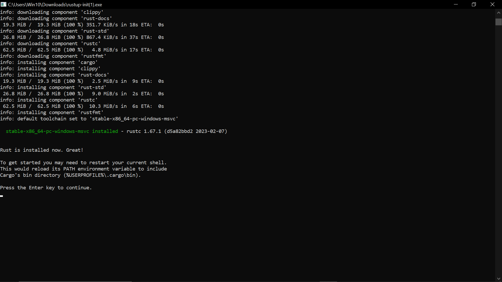
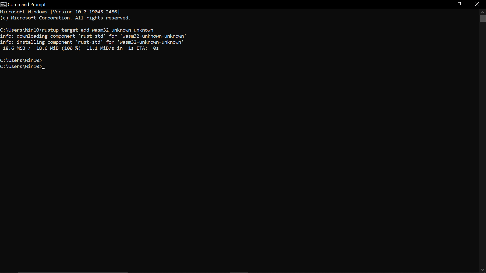
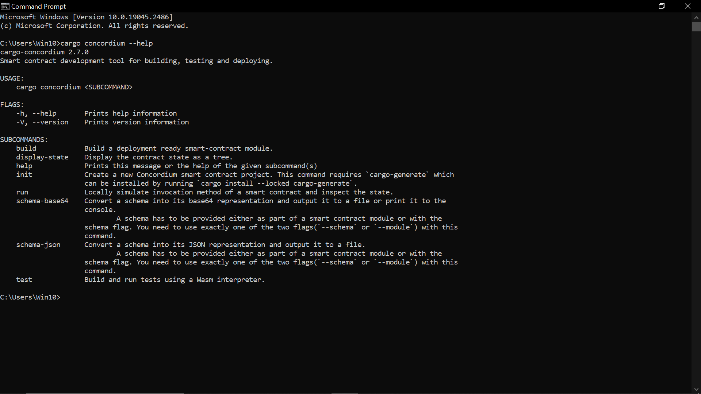
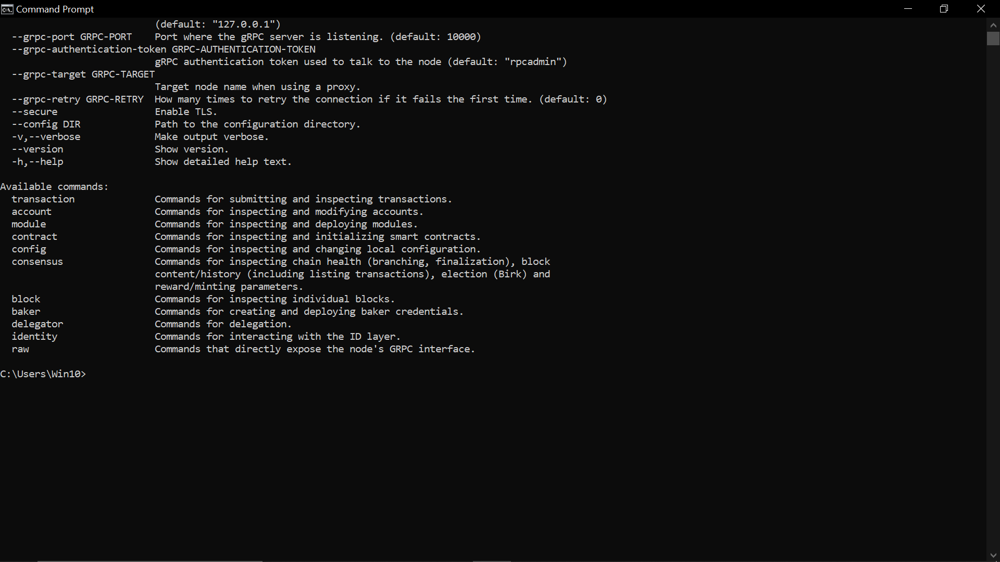
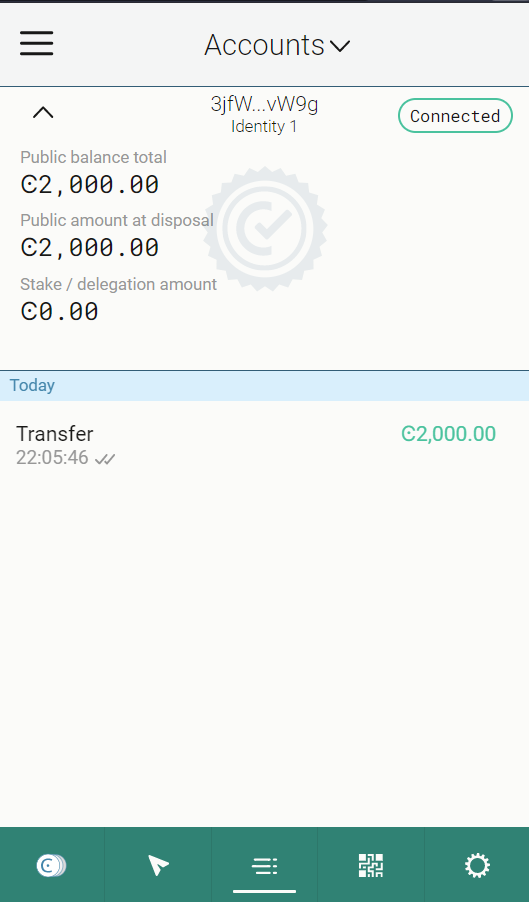
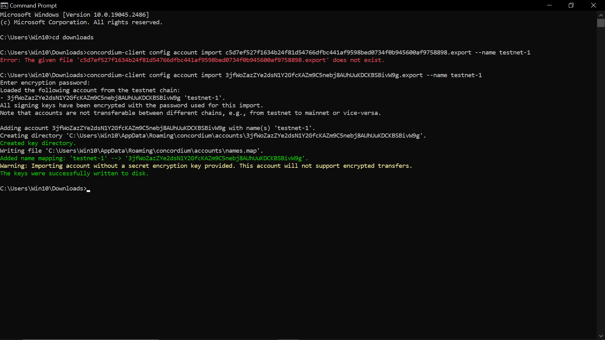

# concordium-task-1-submission
Mainnet Wallet: 

## Introduction
This project is a submission for the Concordium Hackathon Task 1. 
### Step 1: Install Rust
Rust is a programming language that is required to develop and deploy smart contracts on Concordium. To install Rust, please follow the instructions on offical website.

###   Wasm install

### Step 2: Install cargo-concordium
cargo-concordium is a command-line tool that provides several features, including compiling smart contracts, deploying them to the Concordium network, and managing accounts. 

### Step 3: Install Concordium-client
Concordium-client is a graphical user interface that allows you to manage your accounts, transactions, and smart contracts. To install Concordium-client, refer this: 

## Testnet Account
### Step 4: Create a Testnet account and acquiring testnet CCD via the CCD faucet

### Step 5: Export the account from web wallet and import it into Concordium client

